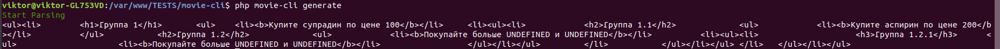
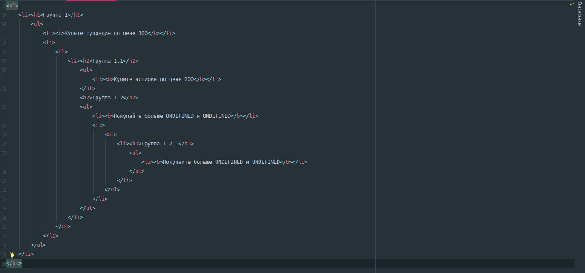

# This is console test app

[Job conditions](https://docs.google.com/document/d/1p6d0_-p2Qx6zM-_lwDbKHSTU17s6LxEzw_p7p_AHwoc/edit#)

## STACK
1. PHP 7.3
2. laravel-zero as console framework

## Deploy

1. pull repo
2. install composer
3. put files `group.csv` and `products.csv` to `/storage` folder
4. run `php console generate`

This will generate in output string

### Example of working:

### Formatted HTML:

